# Cursor IDE Rules - VAN Method (Strict Enforcement)

**Version:** 3.1.0 (VAN Integration + Base Rules Merged)
**Last Updated:** 2026-01-31

## 🚨 CRITICAL: STRICT ENFORCEMENT

These rules are **MANDATORY**. You are operating within the VAN (Visual/Adaptive/Networked) isolation framework. Each mode has specific responsibilities and restricted access.

**Container Runtime:** `docker compose` (NOT docker-compose or podman)

---

## 📂 FRAMEWORK LOCATION

**Extended rules are in `framework/` directory:**
- `framework/rules/` - Detailed Cursor rules (.mdc files)
- `framework/methodology/` - Biswas patterns, decision-making, phases
- `framework/config/` - Configuration files (MCP selection, community nodes)
- `framework/kilocode-skills/` - Kilocode agent skill packages (symlink to ~/.kilocode/skills); use when working on crawl4ai, n8n, MCP building, file-organizer, webapp-testing (see framework/rules/kilocode-skills.mdc)
- `opa/policies/` - OPA enforcement policies

---

## 🧭 MODE-SPECIFIC VISUAL MAPS

```mermaid
graph TD
    subgraph Modes["Cursor Custom Modes"]
        VAN["VAN MODE<br>Initialization"] --> PLAN["PLAN MODE<br>Task Planning"]
        PLAN --> Creative["CREATIVE MODE<br>Design Decisions"]
        Creative --> Implement["IMPLEMENT MODE<br>Code Implementation"]
        Implement --> Reflect["REFLECT MODE<br>Review & QA"]
        Reflect --> Archive["ARCHIVE MODE<br>Documentation"]
    end
    
    VAN -.->|"Loads"| VANRules["• phases/van-mode.mdc<br>• agent-behavior.mdc"]
    PLAN -.->|"Loads"| PLANRules["• phases/plan-mode.mdc<br>• tasks.md"]
    Creative -.->|"Loads"| CreativeRules["• phases/creative-mode.mdc<br>• systemPatterns.md"]
    Implement -.->|"Loads"| ImplementRules["• phases/implement-mode.mdc<br>• progress.md"]
    Reflect -.->|"Loads"| ReflectRules["• phases/reflect-mode.mdc<br>• QA Validation"]
    Archive -.->|"Loads"| ArchiveRules["• phases/archive-mode.mdc<br>• documentation"]
```



---

## ⛔ MANDATORY: MEMORY BANK VERIFICATION

**BEFORE ANY OPERATION in ANY MODE:**

1.  **Check Memory Bank Existence:**
    *   `memory-bank/projectbrief.md`      # Project overview and goals
    *   `memory-bank/productContext.md`    # Product vision and constraints
    *   `memory-bank/systemPatterns.md`    # System design patterns
    *   `memory-bank/techContext.md`       # Technical stack and dependencies
    *   `memory-bank/activeContext.md`     # Current focus and status
    *   `memory-bank/progress.md`          # Implementation progress
    *   `tasks.md`                         # Source of truth for tasks

2.  **If Missing:** STOP. Create the Memory Bank immediately.
3.  **If Present:** Verify structure and proceed.

**Session Start - Always:**
1. **VAN Mode** - Verify environment, determine complexity (Level 1-4)
2. **Read Memory Bank** - Load context from memory-bank/*.md files
3. **Check Active Context** - Review memory-bank/activeContext.md for current state
4. **Review Tasks** - Check tasks.md for active work

**Memory Bank Updates:**
After significant changes, update relevant memory-bank files:
- `activeContext.md` - Current focus and status
- `progress.md` - What's been completed
- `tasks.md` - Task status changes

---

## 🔄 MODE TRANSITION PROTOCOL

You must explicitly transition between modes. Do not perform actions outside the current mode's scope.

### 1. VAN MODE (Initialization)
*   **Goal:** Platform detection, file verification, complexity determination.
*   **Exit Trigger:** Complexity Level determined.
    *   **Level 1 (Quick Fix):** Stay in VAN Mode.
    *   **Level 2-4 (Feature/System):** Transition to **PLAN MODE**.

### 2. PLAN MODE
*   **Goal:** Task breakdown, dependency mapping, updating `tasks.md`.
*   **Exit Trigger:** Plan finalized and documented.
*   **Next Mode:** **CREATIVE MODE**.

### 3. CREATIVE MODE
*   **Goal:** Design decisions, architecture, UI/UX (if applicable).
*   **Exit Trigger:** Design decisions documented in `memory-bank/`.
*   **Next Mode:** **IMPLEMENT MODE**.

### 4. IMPLEMENT MODE
*   **Goal:** Code implementation, service onboarding.
*   **Constraint:** FOLLOW "Add New Service" guide strictly if adding a service.
*   **Exit Trigger:** Implementation complete.
*   **Next Mode:** **REFLECT MODE**.

### 5. REFLECT MODE (QA & Review)
*   **Goal:** 4-Point QA Validation (Dependency, Config, Environment, Build).
*   **Constraint:** **CANNOT BYPASS** without explicit user approval.
*   **Exit Trigger:** QA Passed.
*   **Next Mode:** **ARCHIVE MODE**.

### 6. ARCHIVE MODE
*   **Goal:** Documentation updates, cleanup, final user approval.
*   **Exit Trigger:** Project state marked as DONE.

---

## 🏗️ CORE DEVELOPMENT STANDARDS

### 1. Tool Priority (MANDATORY)

**CRITICAL: Follow this priority order. NEVER skip to custom code.**

1. **Existing n8n workflows** - Check first with `Makafeli: list_workflows`
2. **Native n8n nodes** - Use `FlowEngine: search_nodes` to find
3. **Community n8n nodes** - Check `framework/config/n8n/community-nodes-registry.json`
4. **MCP tools** - FlowEngine (design) or Makafeli (runtime)
5. **Cursor built-in tools** - File operations, search, etc.
6. **Custom code** - LAST RESORT - requires justification

### 2. n8n Workflow Building (CRITICAL)

**You have TWO n8n MCP tools - use the RIGHT one:**

| Task | MCP Tool | Examples |
|------|----------|----------|
| Design-time (build, edit, validate) | **FlowEngine** | build_workflow, add_node, validate_workflow |
| Runtime (deploy, execute, manage) | **Makafeli** | create_workflow, activate_workflow, execute_workflow |

**Standard workflow building process:**
1. `FlowEngine: suggest_architecture` - Get pattern
2. `FlowEngine: build_workflow` - Generate workflow
3. `FlowEngine: validate_workflow` - Validate
4. `FlowEngine: scan_security` - Security check
5. `Makafeli: create_workflow` - Deploy
6. `Makafeli: activate_workflow` - Enable
7. `Makafeli: execute_workflow` - Test
8. `Makafeli: get_execution` - Verify success

**Node selection priority:**
1. Native n8n nodes (HTTP Request, Postgres, etc.)
2. Community nodes (Supercode, Firecrawl, etc.)
3. MCP Client node (for MCP integrations)
4. Supercode node (NOT regular Code node)

**NEVER use regular Code node - use Supercode instead:**
- More libraries (axios, lodash, moment)
- Better error handling
- Multiple modes - ALWAYS set correct mode!
- See `framework/rules/n8n-workflow-building.mdc` for complete guide.

### 3. Container Rules

**IMPORTANT: Always use `docker compose` (with space)**

```bash
# Correct
docker compose up -d
docker compose down
docker compose logs service-name
docker compose ps

# INCORRECT - Never use these
docker-compose up  # Wrong - hyphenated version
podman ...         # Wrong - we don't use podman
```

### 4. Service Onboarding Integration

When adding a new service, you **MUST** follow the `IMPLEMENT` phase rules which strictly enforce the steps in `.claude/commands/add-new-service.md`:

1.  **Docker Compose:** Use `docker compose`, configure profiles, logging, and healthchecks.
2.  **Caddy:** Configure reverse proxy and basic auth.
3.  **Environment:** Update `.env.example` and `scripts/`.
4.  **Wizard/Scripts:** Update `scripts/04_wizard.sh` and others.
5.  **Documentation:** Update README and CHANGELOG.

Refer to `framework/rules/phases/implement-mode.mdc` for the detailed checklist.

---

## 🛡️ QUALITY ASSURANCE & ENFORCEMENT

### 1. OPA Policy Enforcement

Run policy checks at phase gates:
```bash
python scripts/enforcement/run-opa-check.py --policy van_initialization --auto
python scripts/enforcement/run-opa-check.py --policy phase_gate --phase PLAN
python scripts/enforcement/validate-n8n-workflow.sh workflow.json
```

### 2. Output Format (Metacognition)

When making decisions, include:
- Confidence level (0-1)
- Reasoning (3+ factors)
- Risks identified
- Fallback plan if applicable

**Escalation thresholds:**
- < 0.60: ESCALATE to human
- 0.60-0.74: PENDING human review
- 0.75+: Can auto-proceed

---

## 📝 STATUS PREFIXES

Start every response with one of:

*   `[MEMORY_BANK_LOADED]`: Context loaded, ready.
*   `[MEMORY_BANK_MISSING]`: Stopped, initializing.
*   `[MODE_SWITCH_REQUIRED]`: Current mode insufficient for task.
*   `[PHASE_GATE_BLOCKED]`: Checks failed.
*   `[QA_VALIDATION_PENDING]`: Validation in progress.


## Remember

- Start with VAN mode - verify environment first
- Stay in phase, follow gates
- Update Memory Bank regularly
- Express uncertainty when appropriate
- Use n8n workflows before custom code
- Use Supercode, not regular Code node
- Docker Compose only, no podman
