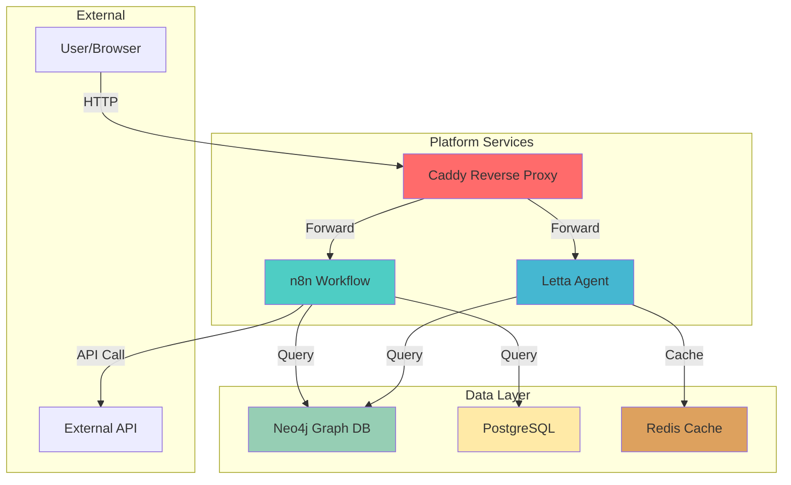
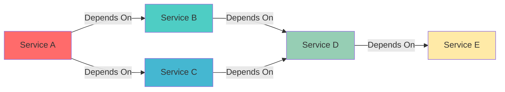
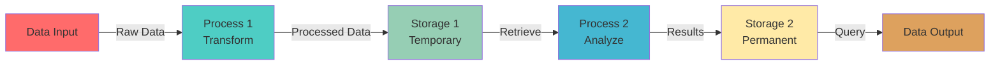
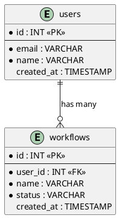
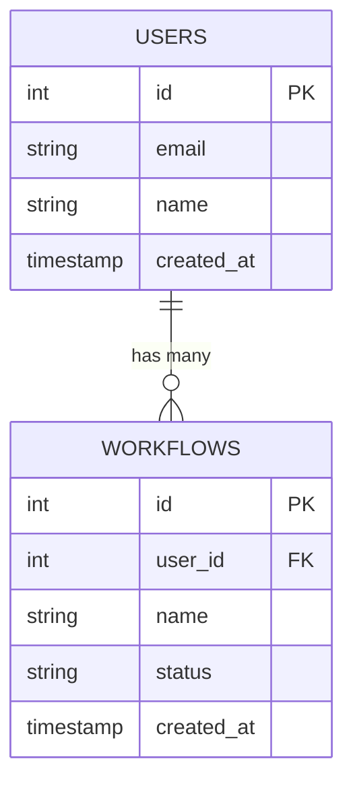
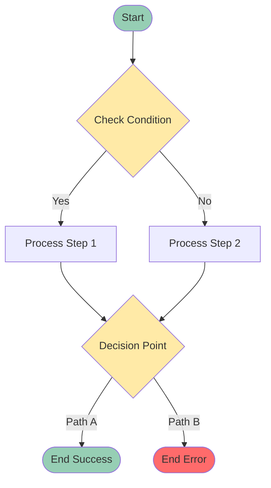
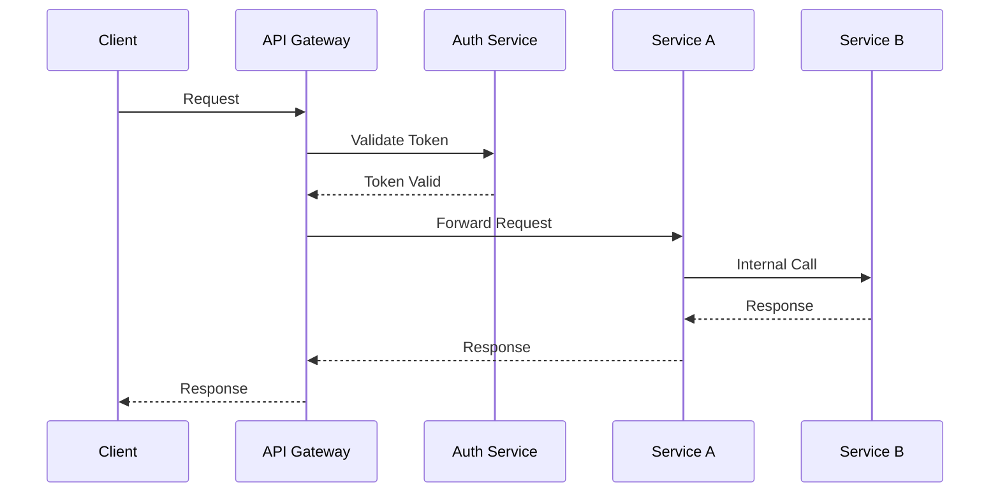

# Diagram Generation Rules

## Overview

This document defines how to generate system diagrams, architecture diagrams, workflow diagrams, and other visual documentation using Mermaid and PlantUML formats.

## Diagram Types

### 1. System Architecture Diagram

**Purpose:** Show all services, relationships, and external systems

**Required Elements:**
- All services in the system
- Service relationships (dependencies)
- External systems (APIs, databases)
- Data flow direction
- Service grouping (if applicable)

**Mermaid Template:**


**Generation Checklist:**
- [ ] All services included
- [ ] Relationships clearly shown
- [ ] External systems identified
- [ ] Color coding for service types
- [ ] Direction arrows for data flow
- [ ] Grouping for logical organization

### 2. Service Dependency Diagram

**Purpose:** Show service dependencies and failure cascade

**Required Elements:**
- Service A depends on Service B
- Data flow between services
- Failure cascade visualization
- Dependency direction

**Mermaid Template:**


**Generation Checklist:**
- [ ] All dependencies shown
- [ ] Direction of dependency clear
- [ ] Failure cascade visible
- [ ] Critical path highlighted

### 3. Data Flow Diagram

**Purpose:** Show how data moves through the system

**Required Elements:**
- Data entry points
- Processing steps
- Storage locations
- Output destinations
- Data transformation points

**Mermaid Template:**


**Generation Checklist:**
- [ ] Entry points identified
- [ ] Processing steps shown
- [ ] Storage locations marked
- [ ] Output destinations clear
- [ ] Data transformation visible

### 4. Database Schema Diagram

**Purpose:** Show database tables, relationships, and key fields

**Required Elements:**
- All tables
- Relationships (foreign keys)
- Key fields (primary keys)
- Indexes (if important)
- Data types (if needed)

**PlantUML Template:**


**Mermaid Alternative (if PlantUML not available):**


**Generation Checklist:**
- [ ] All tables included
- [ ] Relationships shown
- [ ] Primary keys marked
- [ ] Foreign keys identified
- [ ] Important indexes noted

### 5. Workflow Diagram

**Purpose:** Show decision points, process steps, and conditional paths

**Required Elements:**
- Decision points
- Process steps
- Conditional paths
- Start/end points
- Error handling paths

**Mermaid Template:**


**Generation Checklist:**
- [ ] Start/end points clear
- [ ] Decision points identified
- [ ] Process steps shown
- [ ] Conditional paths labeled
- [ ] Error paths included

### 6. API Architecture Diagram

**Purpose:** Show API endpoints, service connections, and authentication flow

**Required Elements:**
- API endpoints
- Service connections
- Authentication flow
- Request/response flow

**Mermaid Template:**


**Generation Checklist:**
- [ ] All endpoints shown
- [ ] Service connections clear
- [ ] Authentication flow visible
- [ ] Request/response flow shown
- [ ] Error paths included

## Diagram Generation Process

### Step 1: Identify Diagram Type
```python
# Determine diagram type based on need
if need == "system_overview":
    diagram_type = "System Architecture Diagram"
elif need == "dependencies":
    diagram_type = "Service Dependency Diagram"
elif need == "data_flow":
    diagram_type = "Data Flow Diagram"
# ... etc
```

### Step 2: Gather Information
- Services/components involved
- Relationships between components
- Data flow direction
- Dependencies
- External systems

### Step 3: Create Diagram
- Use appropriate template
- Fill with gathered information
- Apply color coding
- Add labels and descriptions

### Step 4: Validate Diagram
- [ ] All components included
- [ ] Relationships accurate
- [ ] Direction arrows correct
- [ ] Color coding consistent
- [ ] Diagram renders correctly

### Step 5: Integrate with Documentation
- [ ] Add diagram to appropriate doc
- [ ] Add caption explaining diagram
- [ ] Add alt text for accessibility
- [ ] Update diagram list in overview

## Diagram Location Rules

**System Architecture Diagrams:**
- Location: `docs/architecture/system-diagram.md`
- Or: `docs/architecture/diagrams/system-architecture.mmd`

**Service-Specific Diagrams:**
- Location: `docs/services/[service]/diagrams.md`
- Or: `docs/services/[service]/diagrams/[diagram-name].mmd`

**Workflow Diagrams:**
- Location: `docs/workflows/[workflow-name]-diagram.md`
- Or: Embedded in workflow documentation

**Data Flow Diagrams:**
- Location: `docs/architecture/data-flow.md`
- Or: `docs/architecture/diagrams/data-flow.mmd`

## Mermaid Format Guidelines

**Graph Types:**
- `graph TB` - Top to bottom
- `graph LR` - Left to right
- `flowchart TD` - Flowchart top to bottom
- `sequenceDiagram` - Sequence diagram
- `erDiagram` - Entity relationship

**Styling:**
```mermaid
style NodeName fill:#COLOR,stroke:#COLOR,color:#COLOR
```

**Common Colors:**
- Services: `#4ECDC4` (teal)
- Databases: `#FFEAA7` (yellow)
- External: `#FF6B6B` (red)
- Processing: `#45B7D1` (blue)
- Storage: `#96CEB4` (green)

## Diagram Maintenance

**When to Update Diagrams:**
- When services are added/removed
- When dependencies change
- When data flow changes
- When architecture changes
- On scheduled review date

**Diagram Review Checklist:**
- [ ] All current services included
- [ ] Relationships still accurate
- [ ] Dependencies up to date
- [ ] Data flow correct
- [ ] External systems current
- [ ] Color coding consistent
- [ ] Diagram renders correctly

## Integration with Documentation

**Every Diagram Must Include:**
1. **Caption:** Brief description of what the diagram shows
2. **Alt Text:** For accessibility
3. **Context:** Where it fits in the documentation
4. **Related Docs:** Links to related documentation

**Example:**
```markdown
## System Architecture

The following diagram shows the complete system architecture:

```mermaid
[diagram code]
```

**Figure 1:** System Architecture Diagram - Shows all services, their relationships, and external systems.

*Related Documentation:*
- [Service Dependencies](service-dependencies.md)
- [Data Flow](data-flow.md)
```
